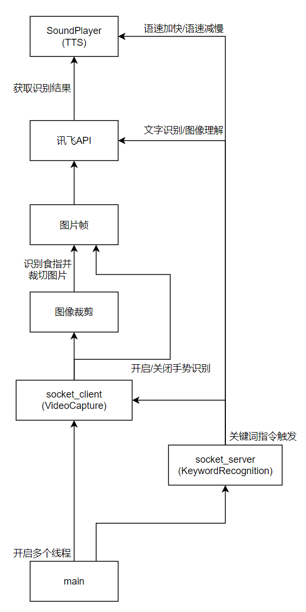

## visual_aid_project

### 项目目的

>  本项目意在开发一个盲人视觉辅助系统的科创项目

### 项目运行方法

1. 安装所需的Python库函数：

    - torch  # recommend GPU version
    - opencv-python==4.9.0.80
    - mediapipe==0.10.11
    - TTS==0.22.0
    - pocketsphinx==5.0.3
    - pygame==2.5.2
    - websocket-client==1.7.0
    - urllib
2. 运行项目文件夹中的 `main.py` 程序

### 功能介绍

- 关键词检测（[参考文档](https://blog.51cto.com/u_16099203/7171249?abTest=51cto)）

  > 由上图中可知，包含6条指令（**语速加快/语速减慢无效**）

- 手势识别（使用[mediapipe库](https://developers.google.com/mediapipe/solutions/guide)）

  > 识别两只手的食指指尖

- OCR文字识别（使用[讯飞通用文字识别intsig API](https://www.xfyun.cn/doc/words/universal-character-recognition/API.html)）

- 图片理解（使用[讯飞星火认知大模型](https://www.xfyun.cn/doc/spark/ImageUnderstanding.html#%E6%8E%A5%E5%8F%A3%E8%AF%B4%E6%98%8E)）

### 项目流程

>  项目运行后会启动 `socket_client` 程序，用于摄像头获取图像帧数据，并启动关键词监听 `socket_server` 程序，两个程序通过TCP/IP协议进行数据交互；当关键词被触发时，`server` 程序会向 `client` 程序发送定义好的指令，`server` 程序接收到指令之后会判断指令类型并进行相应处理。

### 补充

OCR文字识别的本地部署可以参考本人另外一个项目：[hololens2_server](https://github.com/chengyingshe/hololens2_server)

> 该项目基于GitHub上多个开源项目和Flask轻量级Web框架实现了：
>
> OCR文字识别、人脸表情识别、语音识别的Web API搭建

